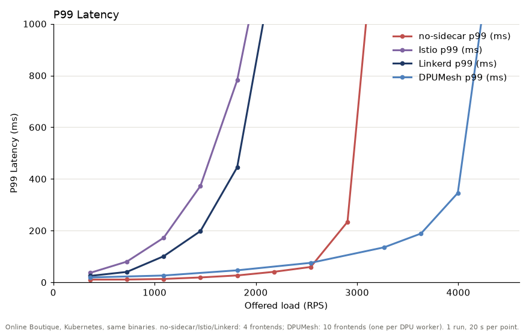

# Online Boutique: no-sidecar, Linkerd, Istio, DPUMesh

Online Boutique를 Kubernetes에서 네 가지 구성으로 실행하고, 정해진 속도로 요청을 넣는 open-loop 부하에서 offered load별 p99 지연을 잰다. 각 구성은 자기에게 맞는 frontend 수로 배치한다.

- 결과: `results/` (구성별 `results/<cfg>/rep1/`, 실행 로그 `results/run-*.log`; 로그의 `k8s-tcp`, `k8s-linkerd`, `k8s-istio`, `k8s-dpumesh`가 각각 `nosidecar`, `linkerd`, `istio`, `dpumesh`다)
- 그래프: `results/p99_vs_load.png` (`plot.py`)
- 재현: `SUDO_PW=... ./run_all.sh`

## 결과



| 구성 | frontend 수 | 포화 직전 offered load (그때 p99) | 포화한 offered load | p99 @ 363 RPS | p99 @ 1,089 RPS | p99 @ 1,816 RPS |
|---|---:|---:|---:|---:|---:|---:|
| Istio | 4 | 726 RPS (76 ms) | 1,089 RPS | 37 ms | 4.1 s (포화) | — |
| Linkerd | 4 | 1,816 RPS (445 ms) | 2,179 RPS | 25 ms | 101 ms | 445 ms |
| no-sidecar | 4 | 2,905 RPS (234 ms) | 3,268 RPS | 11 ms | 13 ms | 27 ms |
| **DPUMesh** | **10** | **3,995 RPS (346 ms)** | 4,358 RPS | 19 ms | 26 ms | 47 ms |

- 포화는 요청 drop이 2%를 넘거나 p99가 2초를 넘은 부하다. 포화 직전은 그 바로 아래 부하다.
- 처리량 순서는 Istio < Linkerd < no-sidecar < DPUMesh다.
  - DPUMesh는 no-sidecar보다 약 1.4배 높은 부하까지 버틴다.
  - Linkerd는 no-sidecar의 약 0.6배, Istio는 약 0.25배에서 무너진다.
- 저부하 p99는 no-sidecar가 가장 낮다. DPUMesh는 홉마다 DPU를 왕복해서 no-sidecar보다 약 8 ms 높다.
- 1회 측정, 지점당 20초다. 반복 측정은 하지 않았다.

## 요청 하나가 하는 일 (RPS가 작은 이유)

no-sidecar가 포화 직전(2,904 rps)일 때 pod 전체가 11.4코어를 쓴다. 요청 하나에 CPU 약 3.9 ms다. 비교로 DeathStarBench hotel-reservation은 17K RPS에서 약 14코어를 써서 요청당 약 0.8 ms다. Online Boutique의 요청 하나가 하는 일이 훨씬 많다.

**부하 구성.** k6는 사용자 행동(task)을 upstream locustfile 비중으로 고른다. 장바구니 담기와 결제는 HTTP 요청을 여러 개 보내서, task 19개가 HTTP 요청 23개가 된다.

| task | 비중 | 보내는 HTTP 요청 |
|---|---:|---|
| 홈 보기 | 1 | `GET /` |
| 통화 변경 | 2 | `POST /setCurrency` |
| 상품 보기 | 10 | `GET /product/…` |
| 장바구니 담기 | 2 | `GET /product/…` → `POST /cart` |
| 장바구니 보기 | 3 | `GET /cart` |
| 결제 | 1 | `GET /product/…` → `POST /cart` → `POST /cart/checkout` |

**HTTP 요청별 호출 서비스.** 요청 23개 중 몇 번 나오는지와 gRPC 수다. 장바구니 상품 1개를 가정했다(`src/frontend/handlers.go`, `src/checkoutservice/main.go`).

| HTTP 요청 (23개 중) | 호출되는 서비스 | gRPC 수 |
|---|---|---:|
| `GET /` (1) | currency(통화 목록), catalog(전체 상품), cart, currency 변환 × 상품 9개, ad | 13 |
| `POST /setCurrency` (2) | 없음(쿠키만 설정) | 0 |
| `GET /product` (13) | catalog, currency(목록), cart, currency(변환), recommendation(→ catalog), catalog × 추천 상품 5개, ad | 12 |
| `POST /cart` (3) | catalog, cart(→ redis) | 2 |
| `GET /cart` (3) | currency(목록), cart, recommendation(→ catalog), catalog × 5, shipping(견적), catalog·currency × 장바구니 상품 | 약 12 |
| `POST /cart/checkout` (1) | checkout → (cart, catalog·currency × 상품, shipping 견적, currency, payment, shipping 발송, email, cart 비우기), recommendation(→ catalog), catalog × 5, currency(목록) | 약 18 |

- 가중 평균은 HTTP 요청 하나당 gRPC 약 10번이다.
- 요청의 절반이 넘는 상품 페이지가 12번을 부른다. 추천 상품 5개를 catalog에 하나씩 다시 묻고, 가격을 currency로 따로 변환하기 때문이다.
- frontend는 매 요청 HTML 페이지 전체를 렌더링한다.
- 서비스가 Go, Python(recommendation, email), Node.js(currency, payment), .NET(cart), Java(ad)로 섞여 있다.

**CPU가 쓰이는 곳** (no-sidecar, 2,904 rps):

| 서비스 | CPU 비중 | 요청당 CPU |
|---|---:|---:|
| frontend (Go, HTML 렌더링) | 35% | 1.35 ms |
| recommendation (Python) | 24% | 0.93 ms |
| productcatalog (Go) | 16% | 0.63 ms |
| currency (Node.js) | 9% | 0.37 ms |
| 나머지 7개 | 16% | 0.63 ms |

**DeathStarBench hotel-reservation과 비교** (`mixed-workload_type_1.lua`):

| HTTP 요청 (비율) | 호출되는 서비스 | gRPC 수 |
|---|---|---:|
| 호텔 검색 (60%) | search → (geo, rate), reservation, profile | 5 |
| 추천 (39%) | recommendation, profile | 2 |
| 로그인 (0.5%) | user | 1 |
| 예약 (0.5%) | user, reservation | 2 |

- 가중 평균은 요청 하나당 gRPC 약 3.8번이다.
- 그 외에 rate·reservation·profile이 memcached를 약 2번 조회한다(없을 때만 MongoDB).
- 응답은 JSON이고, 서비스는 모두 Go다.

## 무엇이 포화하는가

| 구성 | 포화 부근 pod CPU (12코어 중) | 사이드카 CPU 합 | 가장 바쁜 frontend 사이드카 |
|---|---:|---:|---:|
| no-sidecar | 11.4–11.5코어 | — | — |
| Linkerd | 11.1–11.7코어 | 4.6–4.8코어 | 0.57코어 |
| Istio | 9.4–10.0코어 | 4.6–5.0코어 | 0.60코어 |
| DPUMesh | 11.0–11.4코어 (DPU 7.9–8.1코어) | — | — |

- **no-sidecar, Linkerd, DPUMesh:** host CPU가 포화한다.
  - Linkerd는 사이드카가 pod CPU의 약 40%를 써서, no-sidecar보다 낮은 부하에서 CPU가 찬다.
  - Linkerd의 사이드카는 모두 1코어(worker 1개의 상한)보다 한참 아래다.
- **Istio:** host CPU가 2코어가량 남은 상태에서 무너진다. 가장 바쁜 Envoy도 0.6코어라, 무엇이 먼저 막혔는지는 이 측정으로 가리지 못했다.
- **DPUMesh:** DPU 프록시 전체 CPU는 7.9–8.1코어다(event-driven 모드). shard별 포화 여부는 이 측정에서 재지 않았다.

## 배치를 구성마다 다르게 둔 이유

- **DPUMesh는 frontend 10개다.** host 프로세스 하나가 DPU worker 하나에 붙고, frontend의 L7 처리는 그 worker(DPU 코어 1개)에서 돈다. 프록시 worker가 10개라, frontend 10개를 worker마다 하나씩 두어야 DPU 코어를 고르게 쓴다.
- **no-sidecar는 frontend 4개다.** frontend 프로세스는 여러 코어를 쓰므로 프록시 같은 단일 코어 병목이 없다. frontend 수를 늘리면 프로세스 고정 비용만 는다.
- **Linkerd·Istio는 frontend 4개다.** 사이드카는 worker 1개라 1코어만 쓴다. 사이드카 하나가 한계에 닿지 않게 frontend를 나눈다. 이 측정에서 가장 바쁜 frontend 사이드카는 0.6코어 이하다.

## 실험 설정

### 하드웨어

- **Host:** Xeon 6515P 16코어. turbo를 끄고 2.3 GHz로 고정했다.
  - 코어 0–11: 모든 pod(앱, 사이드카, DPUMesh host 라이브러리)
  - 코어 12–15: k6 부하 생성기
- **DPU:** BlueField-3 16코어, DOCA 3.5(host도 3.5). DPU 프록시를 코어 0–11에 묶는다(`taskset -c 0-11`). shard 10개는 코어 2–11, 나머지 스레드는 코어 0–1을 쓴다. cpufreq가 없어 실측 약 2.12 GHz다.

### Kubernetes

- 단일 노드 kubeadm 1.34, Flannel, kube-proxy iptables 모드다.
- kubelet `cpuManagerPolicy: static`, `reservedSystemCPUs: 12-15`, `strict-cpu-reservation`으로 pod를 코어 0–11에 묶는다.
- CPU limit은 걸지 않는다.

### 앱

- Online Boutique v0.10.7 서비스를 host에서 빌드한 바이너리로 pod 안에서 실행한다(`k8sob/gen.py`). 네 구성이 같은 바이너리를 쓴다.
  - pod는 privileged로 host 루트를 마운트하고 `chroot`한다.
  - 네트워크, cgroup, 스케줄링은 Kubernetes가 맡는다.
  - 테스트베드 전용 방식이다.
- replica: frontend 4개(DPUMesh는 10개), productcatalog 4, currency 2, recommendation 5, 나머지 1.
- 서비스 간 연결:
  - frontend 4개는 catalog, currency, recommendation의 모든 replica에 gRPC round-robin한다(`FE_RR=1`).
  - DPUMesh의 frontend 10개는 replica를 나눠 맡는다.
  - replica마다 고정 ClusterIP Service가 있다(`10.99.<replica>.<service>`). 포트 이름이 `grpc`/`http`라 Istio도 L7로 처리한다.
- 앱 변경:
  - frontend는 플랫폼 감지 DNS 조회를 프로세스당 한 번만 한다. 그리고 여러 주소에 gRPC `round_robin`한다.
  - recommendation의 gRPC 스레드 수는 40이다(`MAX_WORKERS`).

### 메시

- **Linkerd:** edge-26.9.3 기본 설치. 사이드카 worker 1개(기본값), CPU limit 없음, mTLS, L7.
- **Istio:** 1.31.1 `profile=minimal`, sidecar 모드. `concurrency: 1`, mTLS, L7.
- **DPUMesh:**
  - 서비스 간 gRPC를 `libdpumesh` DMA 채널로 DPU에 보낸다. DPU의 linkerd2-proxy(`dmesh_doca`)가 L7 처리 후 목적지로 보낸다.
  - DPU 프록시는 shared-nothing worker 10개이고 event-driven 모드다. DPA EU는 worker마다 겹치지 않게 나눈다(`dpumesh/layout10.txt`, `dpumesh/dpu/env.sh`).
  - 홉마다 프록시가 1개(사이드카는 2개)다. 서비스 간 트래픽이 DPU 밖으로 나가지 않아 mTLS가 없다. k6→frontend와 cart→redis는 커널 TCP다.

### 부하와 측정

- **부하 생성:** k6 v2.3.0 `constant-arrival-rate`(open loop)다.
- **task 비율:** upstream locustfile과 같다. index 1, setCurrency 2, browseProduct 10, addToCart 2, viewCart 3, checkout 1이다. redirect를 따라가지 않아 task 19개당 요청이 23개다(offered RPS = tasks/s × 23/19).
- **k6 연결:** k6는 frontend마다 있는 ClusterIP로 요청을 보낸다. VU마다 frontend 하나를 쓴다.
- **측정 절차:**
  - 구성마다 클러스터를 새로 배포한다(메시 설치, DPU 프록시 시작 포함).
  - 200 tasks/s로 60초 워밍업한다.
  - 부하마다 10초 워밍업 후 20초 측정하고, 측정 구간의 모든 요청으로 p99를 낸다.
  - 부하는 300 tasks/s(363 RPS) 간격으로 올리고, 포화하면 그 구성의 측정을 끝낸다.
- **CPU 기록:**
  - pod 전체는 kubepods cgroup, 컨테이너별은 `cpusnap.py`로 잰다.
  - DPU는 `/proc/stat`으로 잰다.

## 환경 준비

아래는 이 측정을 처음부터 다시 돌리기 위한 준비다. 테스트베드 값은 host `jet1`, DPU `192.168.100.2`다.

### Host

1. **CPU 주파수를 고정한다.** turbo를 끄고 2.3 GHz로 고정한다.

   ```sh
   echo 1 | sudo tee /sys/devices/system/cpu/intel_pstate/no_turbo
   sudo cpupower frequency-set -g performance -d 2.3GHz -u 2.3GHz
   ```

2. **단일 노드 Kubernetes를 만든다.** kubeadm 1.34와 Flannel을 쓴다. 노드 하나에 pod를 띄우려면 control-plane taint를 지워야 한다(`kubectl taint nodes --all node-role.kubernetes.io/control-plane-`).
   - kubelet 설정(`/var/lib/kubelet/config.yaml`)에 아래 항목을 넣고 kubelet을 재시작한다.

     ```yaml
     cpuManagerPolicy: static
     reservedSystemCPUs: "12-15"
     cpuManagerPolicyOptions:
       strict-cpu-reservation: "true"
     ```

   - static 정책으로 바꿀 때는 kubelet을 멈추고 `/var/lib/kubelet/cpu_manager_state`를 지운 뒤 다시 시작한다.

3. **도구를 PATH에 둔다.** k6 v2.3.0, `linkerd` edge-26.9.3, `istioctl` 1.31.1, `kubectl`이 필요하다. 메시는 `run.sh`가 측정마다 직접 설치하고 지운다.

4. **서비스 바이너리를 빌드한다.**
   - DPUMesh host 라이브러리와 gRPC 연동 라이브러리를 먼저 빌드한다(DPUMesh `README.md`, `integrations/grpc/README.md`). 결과는 `~/DPUMesh/build`에 생긴다.
   - 그다음 서비스를 빌드한다. 결과는 `../dpumesh/.build`(Go 바이너리, venv, JDK, .NET)에 생긴다.

     ```sh
     DPUMESH_ROOT=~/DPUMesh ../dpumesh/setup.sh
     ```

5. **그래프용 Python 환경을 만든다.** `python3 -m venv .venv && .venv/bin/pip install matplotlib`

### DPU

1. **DPUMesh를 받아 프록시를 빌드한다.** DPUMesh(`feature/grpc-perf` 이후 버전)를 DPU의 `~/DPUMesh-online-boutique`에 둔다. DPA EU 범위 설정과 linkerd2-proxy 서브모듈(worker 분할, `dmesh_doca`)이 필요하므로 `git submodule update --init`까지 한다. 그다음 transport, linkerd2-proxy, mock 제어 평면을 빌드한다.

   ```sh
   ~/DPUMesh-online-boutique/bench/grpc/dpu/build.sh
   ```

   - DPU에는 인터넷이 없어서, Rust와 crate는 오프라인으로 준비해 둔다(`~/opt/rust`, `CARGO_HOME=~/opt/cargo-home`).

2. **시작 스크립트를 복사한다.** `run.sh`는 ssh로 DPU의 `~/DPUMesh-online-boutique/ob-bench/start.sh`를 부른다.

   ```sh
   ssh 192.168.100.2 mkdir -p DPUMesh-online-boutique/ob-bench
   scp dpumesh/dpu/env.sh dpumesh/dpu/start.sh 192.168.100.2:DPUMesh-online-boutique/ob-bench/
   ```

3. **host에서 DPU로 비밀번호 없이 ssh할 수 있어야 한다.**

### 고정값과 권한

- **DPU 주소:** `192.168.100.2`가 `k8sob/run.sh`(`DPU=`)에 고정돼 있다.
- **PCI 주소:** DPU 장치 `03:00.1`, representor `0b:00.1`은 `dpumesh/dpu/env.sh`에 있다. host 쪽 Comch `0b:00.1`은 `k8sob/gen.py`의 `DPUMESH_PCI_ADDR`에 있다.
- **`SUDO_PW`:** DPU의 sudo 비밀번호다. DPU 프록시는 representor 목록을 읽기 위해 root로 떠야 하고, 시작 후 shard 스레드를 코어에 고정할 때도 root가 필요하다. 환경변수로만 넘기고 파일에 적지 않는다.
- **DPA EU 범위:** `dpumesh/dpu/env.sh`가 worker 10개용 범위(`DPUMESH_DPA_EU_END=190`, `DPUMESH_DPA_EU_OFFSETS`)를 정한다. 배치를 바꾸면 `dpumesh/gen_layout.py`로 다시 계산한다. 변수 설명은 DPUMesh `design/HOST.md`에 있다.
- **mock 제어 평면:** mock identity의 인증서는 mock이 시작한 시점부터 24시간 유효하다. `run.sh`는 측정마다 mock을 새로 띄운다(`start.sh mocks`). 프록시를 재시작할 때는 mock을 유지한다.
- **host 쪽 pod:** pod는 privileged이고 host 루트를 마운트한다. 테스트베드 전용이다. DOCA Comch를 쓰려면 memlock 한도가 무제한이어야 해서, `gen.py`가 pod 시작 시 `ulimit -l unlimited`를 건다.

## 재현

```sh
cd mesh-bench
SUDO_PW=... ./run_all.sh       # 네 구성 측정 → results/, 그래프 → results/p99_vs_load.png
.venv/bin/python plot.py      # 그래프만 다시 그리기
```

- `k8sob/run.sh`: 구성 하나의 부하 sweep
- `k8sob/gen.py`: pod manifest 생성(`tcp-fe4.yaml`, `dpumesh.yaml`)
- `dpumesh/gen_layout.py`: DPU worker 배치와 DPA EU 범위 계산
- `dpumesh/dpu/`: DPU 프록시 시작 스크립트
- 사전 준비:
  - DPU의 `~/DPUMesh-online-boutique`에 프록시를 빌드해 둔다.
  - host에 서비스 바이너리(`../dpumesh/.build`)와 DPUMesh 라이브러리(`~/DPUMesh/build`)를 빌드해 둔다.
