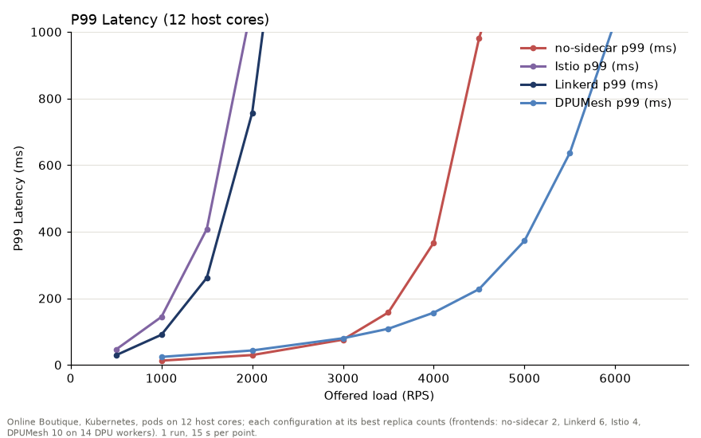
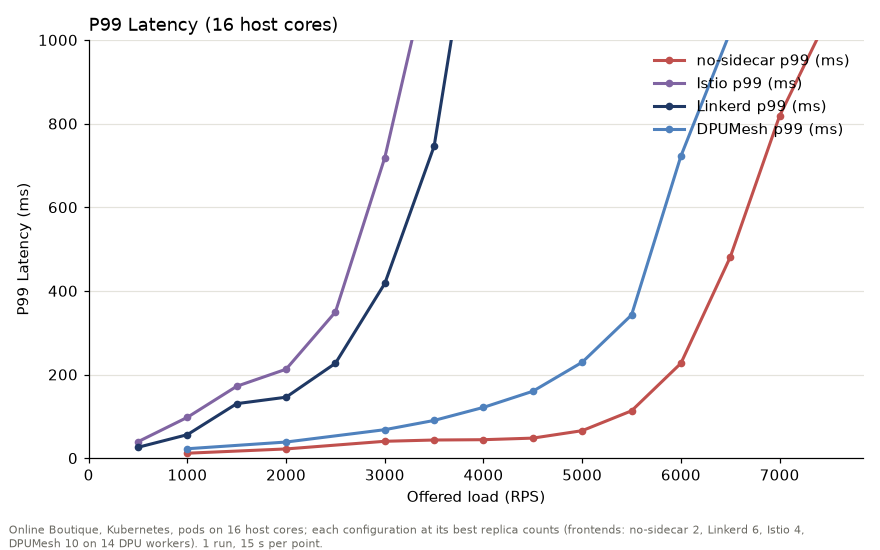
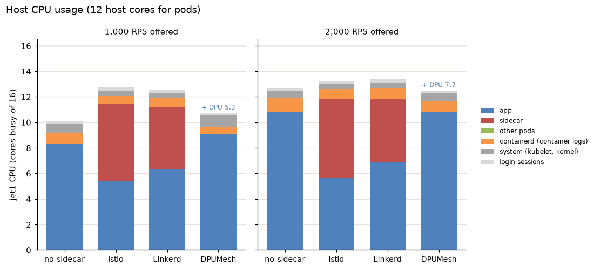
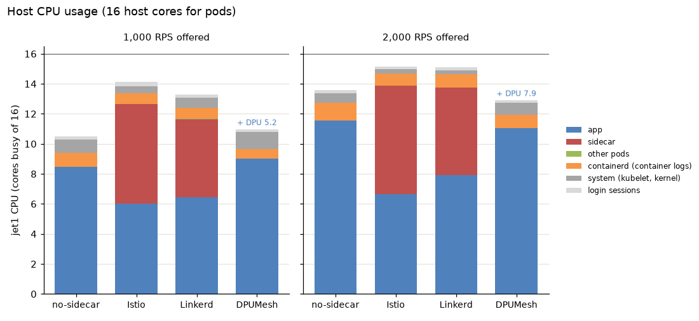
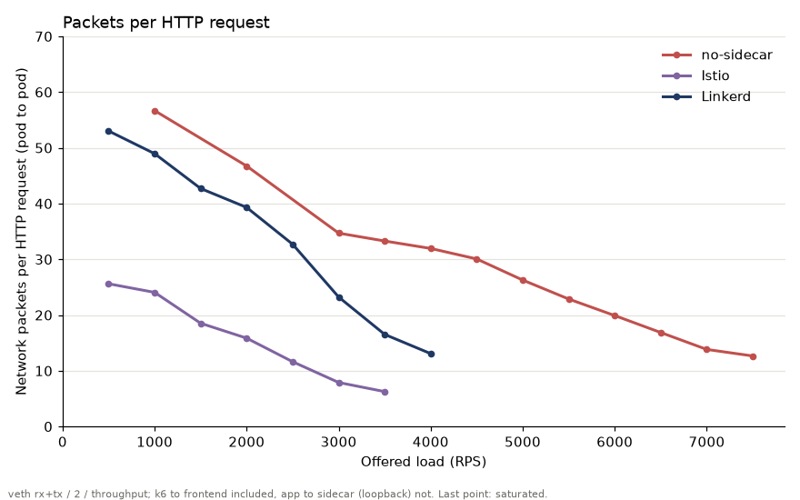

# Online Boutique: no-sidecar, Linkerd, Istio, DPUMesh

Online Boutique를 Kubernetes에서 네 가지 구성으로 실행한다. 정해진 속도로 요청을 넣는 open-loop 부하에서 offered load별 p99 지연과 host CPU 사용량을 잰다. 측정 대상 서버(jet1)와 부하·제어 서버(jet2)를 나눈 2노드 bare-metal 클러스터다. pod가 쓸 수 있는 jet1 코어 수를 바꿔 두 번 잰다.

| 실험 | pod가 쓰는 jet1 코어 | 결과 |
|---|---|---|
| A | 12개 (0–11; 12–15는 시스템 몫) | `results/12core/` |
| B | 16개 전부 | `results/16core/` |

- DPU(BlueField-3)는 두 실험 모두 16코어를 쓴다.
- 각 구성은 host 코어를 다 쓰면서 가장 높은 부하까지 버티는 배치로 잰다(아래 "배치"). 두 실험의 배치는 같다.
- 결과: `results/<12core|16core>/<구성>/rep1/`, 실행 로그 `results/<12core|16core>/run.log`
- 그래프(실험마다): `p99_vs_load.png`(`plot.py`), `host_cpu.png`(`cpu_plot.py`), `packets_per_request.png`(`packets_plot.py`)
- 재현: 아래 "재현"

## 요약

| 구성 | frontend | A (12코어): p99 ≤ 200 ms 최대 부하 | A: 최대 처리량 | B (16코어): p99 ≤ 200 ms 최대 부하 | B: 최대 처리량 |
|---|---:|---:|---:|---:|---:|
| Istio | 4 | 1,000 | 1,919 | 1,500 | 3,229 |
| Linkerd | 6 | 1,000 | 2,253 | 2,000 | 3,661 |
| no-sidecar | 2 | 3,500 | 4,706 | **5,500** | **7,255** |
| DPUMesh | 10 | **4,000** | **5,988** | 4,500 | 6,331 |

단위는 초당 HTTP 요청 수(RPS)다.
- **p99 ≤ 200 ms 최대 부하:** 잰 부하 가운데 p99가 200 ms 이하인 가장 높은 부하다. 부하 간격(500–1,000 RPS)만큼의 해상도다.
- **최대 처리량:** sweep에서 k6가 받은 응답의 초당 수 가운데 가장 큰 값이다. 포화 지점의 값이라 그때 p99는 1–2초다.

결과는 다음과 같다.
- **12코어:** Istio < Linkerd < no-sidecar < DPUMesh 순이다.
- **16코어:** Istio < Linkerd < DPUMesh < no-sidecar 순이다.
- **순서가 바뀌는 이유:** host 코어를 12개에서 16개로 늘리면 no-sidecar의 최대 처리량은 54% 늘지만(4,706 → 7,255), DPUMesh는 6%(5,988 → 6,331)만 는다. DPUMesh는 DPU 프록시가 먼저 막혀서 host 코어가 늘어도 거의 따라 오르지 않는다. 자세한 근거는 "12코어와 16코어에서 순서가 바뀌는 이유"에 있다.

## 실험 A: pod 12코어



offered load별 p99 지연(ms)이다. 빈칸은 재지 않은 부하다.

| 구성 | frontend | 500 | 1,000 | 1,500 | 2,000 | 2,500 | 3,000 | 3,500 | 4,000 | 4,500 | 5,000 | 5,500 | 6,000 | 6,500 |
|---|---:|---:|---:|---:|---:|---:|---:|---:|---:|---:|---:|---:|---:|---:|
| Istio | 4 | 46 | 144 | 408 | **1,085 (포화)** | | | | | | | | | |
| Linkerd | 6 | 29 | 90 | 261 | 757 | **1,792 (포화)** | | | | | | | | |
| no-sidecar | 2 | | 13 | | 29 | | 76 | 157 | 367 | 981 | **1,413 (포화)** | | | |
| DPUMesh | 10 | | 24 | | 43 | | 80 | 108 | 157 | 227 | 372 | 637 | 1,033 | **1,615 (포화)** |

- **포화:** 시작하지 못한 task(drop)가 2%를 넘거나 p99가 2초를 넘은 부하다. 그 구성의 측정은 거기서 끝낸다.
- **no-sidecar와 DPUMesh:** 3,000 RPS까지 p99가 거의 같다(76 대 80 ms). 그 위에서 no-sidecar는 3,500 → 4,000 RPS에 157 → 367 ms로 꺾인다. DPUMesh는 4,000 RPS 157 ms, 5,000 RPS 372 ms로 약 1,000 RPS 더 버틴다.
- **사이드카 메시:** 1,000 RPS에서 이미 p99가 90–144 ms이고, 2,000–2,500 RPS에서 포화한다. Linkerd가 Istio보다 같은 부하에서 p99가 낮고 한 단계(500 RPS) 늦게 포화한다.
- **저부하 p99:** 1,000 RPS에서 no-sidecar 13 ms, DPUMesh 24 ms다. DPUMesh는 홉마다 DPU를 왕복한다.
- **host CPU:** 네 구성 모두 포화 부근에서 앱(+사이드카)이 pod 12코어 중 11.7–11.9코어를 쓴다.

## 실험 B: pod 16코어



| 구성 | frontend | 500 | 1,000 | 1,500 | 2,000 | 2,500 | 3,000 | 3,500 | 4,000 | 4,500 | 5,000 | 5,500 | 6,000 | 6,500 | 7,000 | 7,500 |
|---|---:|---:|---:|---:|---:|---:|---:|---:|---:|---:|---:|---:|---:|---:|---:|---:|
| Istio | 4 | 39 | 98 | 172 | 213 | 350 | 719 | **1,229 (포화)** | | | | | | | | |
| Linkerd | 6 | 26 | 56 | 130 | 146 | 227 | 418 | 746 | **1,477 (포화)** | | | | | | | |
| no-sidecar | 2 | | 12 | | 22 | | 40 | 43 | 44 | 48 | 66 | 113 | 227 | 481 | 819 | **1,060 (포화)** |
| DPUMesh | 10 | | 23 | | 39 | | 68 | 90 | 121 | 160 | 229 | 342 | 722 | **1,020 (포화)** | | |

- **no-sidecar:** 3,000–4,500 RPS에서 p99가 40–48 ms로 평평하다. 5,500 RPS에서 113 ms, 6,000 RPS에서 227 ms가 되고 7,500 RPS에서 포화한다.
- **DPUMesh:**
  - 3,000 RPS 이후에도 p99가 계속 오른다(68 → 90 → 121 → 160 ms). 같은 구간에서 no-sidecar는 평평하다.
  - 6,000 RPS에서 722 ms가 되고 6,500 RPS에서 포화한다.
- **사이드카 메시:** Linkerd가 Istio보다 같은 부하에서 p99가 낮고 한 단계 늦게 포화한다(4,000 대 3,500 RPS).
- **저부하 p99:** 1,000 RPS에서 no-sidecar 12, DPUMesh 23, Linkerd 56, Istio 98 ms다.
- **DPUMesh 5,000 RPS 재측정:** 전체 sweep에서는 이 지점이 479 ms(최대 869 ms)로 앞뒤 지점과 맞지 않게 튀었다. 그래서 그 지점만 다시 쟀다.
  - 4,500 → 5,000 → 5,500 순서로 한 번(229 ms), 새로 배포한 뒤 5,000 RPS만 한 번(232 ms)이다.
  - 표와 그래프에는 첫 번째 값을 쓴다. 튄 원인은 확인하지 않았다. `run.log` 끝에 기록이 있다.

## 12코어와 16코어에서 순서가 바뀌는 이유

DPUMesh가 버티는 부하는 두 한계 가운데 낮은 쪽으로 정해진다.
- **host 한계:** 앱이 jet1 CPU를 다 쓰는 부하다. host 코어 수에 따라 움직인다.
- **DPU 한계:** DPU 프록시의 shard가 차는 부하다. host 코어 수와 무관하다.

no-sidecar는 host 한계만 있다.

| | no-sidecar A (12) | no-sidecar B (16) | DPUMesh A (12) | DPUMesh B (16) |
|---|---:|---:|---:|---:|
| 4,000 RPS p99 | 367 ms | 44 ms | 157 ms | 121 ms |
| 6,000 RPS p99 | (5,000에서 포화) | 227 ms | 1,033 ms | 722 ms |
| p99 ≤ 200 ms 최대 부하 | 3,500 | 5,500 | 4,000 | 4,500 |
| 최대 처리량 | 4,706 | 7,255 | 5,988 | 6,331 |
| 최대 처리량에서 앱 CPU | 11.8코어 | 14.4코어 | 11.8코어 | 13.9코어 |
| 가장 바쁜 DPU shard (3,000 RPS 이상) | — | — | 0.99코어 | 0.99코어 |

1. **no-sidecar의 곡선은 host 코어를 따라 크게 움직인다.** 4,000 RPS의 p99가 367 ms에서 44 ms로 내려가고, 최대 처리량이 54% 는다.
2. **DPUMesh의 곡선은 조금만 움직인다.** 4,000 RPS p99는 157 → 121 ms, 최대 처리량은 5,988 → 6,331로 6% 는다. 두 실험 모두 약 6,000 RPS에서 막힌다. 이것이 DPU 한계다.
3. **12코어:** no-sidecar의 host 한계(약 4,700 RPS)가 DPUMesh의 DPU 한계(약 6,000 RPS)보다 낮다. 그래서 DPUMesh가 이긴다.
   - pod 12코어가 다 찬 상태에서 처리하는 양이 DPUMesh가 27% 많다(5,988 대 4,706 RPS, 둘 다 앱 11.8코어). HTTP 요청당 앱 CPU로는 1.96 대 2.52 ms이고, DPUMesh가 22% 적다.
   - 서비스 간 gRPC가 커널 TCP(veth, iptables) 대신 DMA로 가서 host의 네트워크 처리가 빠지기 때문으로 본다. HTTP 요청당 pod 간 패킷은 no-sidecar 12–56개, DPUMesh 3–4개다. 프로파일로 나누어 확인하지는 않았다.
   - 같은 부하에서 비교하면 HTTP 요청당 CPU는 둘이 거의 같다(예: 4,000 RPS 2.9 ms). 부하가 오를수록 요청당 CPU가 줄어들기 때문에("부하에 따른 비용 변화"), 처리 능력은 host가 다 찼을 때의 처리량으로 비교한다.
4. **16코어:** no-sidecar의 host 한계가 7,000 RPS 이상으로 오른다. DPUMesh는 DPU 한계(약 6,000 RPS) 근처에서 멈춘다. 그래서 no-sidecar가 이긴다.
   - DPUMesh도 포화 부근에서 jet1을 15.7코어 쓴다. 하지만 HTTP 요청당 앱 CPU가 12코어 때보다 크다(2.20 대 1.96 ms). 늘어난 host 코어가 처리량으로 이어지지 않았다는 뜻이다. 그 CPU가 어디에 쓰였는지는 나누지 않았다.

### DPU에서 막히는 이유

실험 B의 DPU 프록시 shard별 CPU(코어)다. frontend가 붙은 shard 10개(worker 0–9)와 나머지 4개(worker 10–13: checkout, cart·payment, shipping, ad)를 나눴다. 실험 A도 거의 같다.

| 부하 | frontend shard 10개 평균 | frontend shard 최대 | 나머지 shard 4개 | DPU 전체 (16코어 중) |
|---:|---:|---:|---:|---:|
| 1,000 | 0.43 | 0.73 | 0.03–0.14 | 5.2 |
| 2,000 | 0.66 | 0.98 | 0.05–0.27 | 7.9 |
| 3,000 | 0.78 | 0.99 | 0.05–0.37 | 9.1 |
| 4,000 | 0.82 | 0.99 | 0.05–0.40 | 9.6 |
| 5,000 | 0.84 | 0.99 | 0.04–0.45 | 10.1 |
| 6,000 | 0.79 | 0.99 | 0.04–0.49 | 9.0 |

- **L7 처리는 부르는 쪽의 shard에서 돈다.**
  - 프로세스 하나는 DPU worker(shard) 하나에 붙는다. 그 프로세스가 연 연결의 HTTP/2 처리는 그 shard가 한다.
  - OB는 HTTP 요청 하나에 gRPC가 약 10번 따르고, 대부분 frontend가 부른다. 그래서 frontend가 붙은 shard 10개에 일이 몰린다. 나머지 shard 4개는 0.5코어 이하다.
  - DPU 16코어 중 약 9–10코어만 쓰인다.
- **가장 바쁜 shard가 p99를 정한다.**
  - 각 VU는 frontend 하나에 고정되어 있어서, 요청의 약 1/10씩이 shard 하나를 지난다.
  - 한 shard가 1코어에 닿으면 그 shard를 지나는 요청이 큐에서 기다린다. 상위 1%인 p99는 그 대기로 정해진다.
  - 가장 바쁜 shard는 2,000–3,000 RPS에서 1코어에 닿는다. DPUMesh의 p99가 no-sidecar와 달리 3,000 RPS 이후에도 계속 오르는 것과 맞는다.
  - frontend shard끼리도 부하가 0.6–1.0코어로 고르지 않다. 같은 shard에 있는 서버 프로세스의 몫이 더해지지만, 차이의 원인은 확인하지 않았다.
- **frontend를 shard 수만큼 늘릴 수 없다(DPA EU 예산).**
  - 앱의 연결(프로세스 → 목적지) 하나가 DMA flow 하나이고, flow마다 자기 forward 링이 있다. DPU는 flow마다 DPA 스레드를 하나 배정한다. 그 스레드는 EU 하나에 고정되어 그 링만 폴링한다.
  - frontend 하나는 7개 서비스(catalog, currency, recommendation, cart, shipping, checkout, ad)로 연결을 열어 DPA 스레드 7개를 쓴다. 서버 쪽도 백엔드 연결마다 스레드를 쓴다.
  - DPA 스레드는 선점되지 않는다. 두 flow가 EU 하나를 같이 쓰면 바쁜 쪽이 다른 쪽을 굶겨, 그 flow의 요청이 수백 ms에서 측정 내내 멈춘다. 그래서 flow마다 EU가 따로 있어야 한다.
  - 장치가 DPA 스레드를 받는 EU는 190개다. 이 배치(frontend 10, worker 14)는 worker별 최대 스레드 합이 135개다(`results/16core/dpumesh/rep1/eu_check.txt`). frontend 16개 배치는 202개가 필요해 넘친다.
  - host 라이브러리에는 pod의 연결들이 링 K개를 나눠 쓰는 설계가 남아 있다(`DPUMESH_RINGS_PER_POD`, 기본 2). 하지만 지금의 dpu-dma 경로에서는 버퍼 크기 계산에만 쓰이고, 링은 연결마다 연다.
- **DeathStarBench와 다른 이유(추정):** DeathStarBench hotel-reservation은 HTTP 요청 하나에 gRPC가 약 3.8번이다(아래 "요청 하나가 하는 일"). 같은 RPS에서 DPU가 처리할 gRPC가 OB의 약 40%라 DPU 한계가 훨씬 높고, host가 먼저 찬다. 그래서 16코어에서도 DPUMesh가 이기는 것으로 본다. DeathStarBench에서 shard별 DPU CPU는 재지 않았다.

## Host CPU 사용량 (앱·사이드카 구분)




jet1 16코어 전체의 사용량을 나눈 값이다(코어). 실험 A에서도 jet1 16코어 전체를 센다. pod는 0–11에서만 돌고, kubelet, containerd, 커널은 코어를 가리지 않는다.

**실험 A (pod 12코어)**

| 부하 | 구성 | 앱 | 사이드카 | containerd | 시스템 | 로그인 세션 | jet1 합계 | DPU |
|---|---|---:|---:|---:|---:|---:|---:|---:|
| 1,000 RPS | no-sidecar | 8.31 | — | 0.82 | 0.77 | 0.16 | 10.06 | — |
| | Istio | 5.39 | 6.02 | 0.65 | 0.40 | 0.30 | 12.76 | — |
| | Linkerd | 6.33 | 4.88 | 0.69 | 0.43 | 0.24 | 12.56 | — |
| | DPUMesh | 9.06 | — | 0.59 | 0.91 | 0.17 | 10.73 | 5.28 |
| 2,000 RPS | no-sidecar | 10.83 | — | 1.11 | 0.53 | 0.16 | 12.63 | — |
| | Istio | 5.65 | 6.19 | 0.76 | 0.38 | 0.22 | 13.21 | — |
| | Linkerd | 6.88 | 4.95 | 0.86 | 0.37 | 0.33 | 13.38 | — |
| | DPUMesh | 10.82 | — | 0.84 | 0.61 | 0.21 | 12.51 | 7.67 |

**실험 B (pod 16코어)**

| 부하 | 구성 | 앱 | 사이드카 | containerd | 시스템 | 로그인 세션 | jet1 합계 | DPU |
|---|---|---:|---:|---:|---:|---:|---:|---:|
| 1,000 RPS | no-sidecar | 8.47 | — | 0.91 | 0.89 | 0.23 | 10.51 | — |
| | Istio | 6.04 | 6.60 | 0.72 | 0.49 | 0.27 | 14.12 | — |
| | Linkerd | 6.45 | 5.20 | 0.75 | 0.65 | 0.25 | 13.32 | — |
| | DPUMesh | 9.01 | — | 0.66 | 1.13 | 0.17 | 10.99 | 5.20 |
| 2,000 RPS | no-sidecar | 11.56 | — | 1.15 | 0.66 | 0.18 | 13.57 | — |
| | Istio | 6.64 | 7.24 | 0.77 | 0.31 | 0.16 | 15.14 | — |
| | Linkerd | 7.93 | 5.81 | 0.88 | 0.29 | 0.18 | 15.10 | — |
| | DPUMesh | 11.04 | — | 0.87 | 0.83 | 0.16 | 12.89 | 7.91 |

- **사이드카가 앱의 CPU를 가져간다.** 1,000 RPS에서 사이드카가 Istio 6.0–6.6코어, Linkerd 4.9–5.2코어를 쓴다.
- **DPUMesh에는 사이드카가 없고, 메시 처리는 DPU에서 돈다.** 1,000 RPS에서 DPU 5.2코어, 2,000 RPS에서 7.7–7.9코어다.
  - 저부하에서는 DPUMesh의 앱 CPU가 no-sidecar보다 0.5–0.8코어 많다. host 라이브러리(DMA 채널)가 앱 프로세스 안에서 돌기 때문인데, 그 안의 어느 부분이 드는지는 나누지 않았다.
  - 시스템 몫도 0.1–0.2코어 크다. 원인은 확인하지 않았다.
- **containerd(0.6–1.2코어):** 서비스들이 요청마다 stdout에 로그를 쓰고, containerd가 그것을 받아 로그 파일로 넘긴다. 네 구성에 공통이고 부하에 비례해 는다.
- **시스템:** kubelet, 커널 스레드 등이다.
- **로그인 세션:** 측정 중 다른 프로그램이 돌았는지 보려고 따로 잰다(user.slice). 모든 지점에서 0.33코어 이하다.
- **기타 pod(Flannel, kube-proxy):** 0.01코어 이하라 표에서 뺐다.

## 무엇이 포화하는가

포화 직전 부하(포화로 판정되지 않은 마지막 부하)의 값이다. 코어 단위다.

| 실험 | 구성 | 부하 | 앱+사이드카 | 사이드카 합 | 가장 바쁜 사이드카 | 가장 바쁜 recommendation | jet1 전체 | DPU (가장 바쁜 shard) |
|---|---|---:|---:|---:|---:|---:|---:|---:|
| A (12) | Linkerd | 2,000 | 11.83 | 4.95 | 0.42 (frontend) | 0.34 | 13.38 | — |
| | Istio | 1,500 | 11.74 | 6.11 | 0.58 (frontend) | 0.29 | 13.08 | — |
| | no-sidecar | 4,500 | 11.82 | — | — | 0.42 | 13.77 | — |
| | DPUMesh | 6,000 | 11.85 | — | — | 0.37 | 13.82 | 9.46 (0.99) |
| B (16) | Linkerd | 3,500 | 14.43 | 6.04 | 0.51 (frontend) | 0.40 | 15.72 | — |
| | Istio | 3,000 | 14.29 | 7.45 | 0.77 (frontend) | 0.35 | 15.54 | — |
| | no-sidecar | 7,000 | 14.28 | — | — | 0.50 | 15.85 | — |
| | DPUMesh | 6,000 | 13.89 | — | — | 0.39 | 15.66 | 9.04 (0.99) |

- **사이드카 메시와 no-sidecar는 host CPU가 한계다.**
  - 앱+사이드카가 pod 코어를 거의 다 쓴다(12코어 중 11.7–11.8, 16코어 중 14.3–14.4).
  - 사이드카는 모두 worker 1개의 상한인 1코어보다 아래다.
  - recommendation(Python) replica는 0.5코어 이하라, 프로세스 하나의 상한(약 0.6코어)에 닿지 않는다.
  - 프로세스 하나가 아니라 host 전체가 먼저 찬다.
- **DPUMesh:** 가장 바쁜 DPU shard가 0.99코어다. 16코어에서는 앱+사이드카가 13.9코어로 다른 구성보다 0.4–0.5코어 적다.
- **Linkerd와 Istio:** 같은 부하에서 앱+사이드카 CPU는 비슷하지만 나뉘는 방식이 다르다.
  - 사이드카 비중이 Linkerd 42–45%, Istio 52–53%다.
  - Linkerd는 사이드카를 적게 쓰는 대신 앱 CPU가 많고, 요청당 패킷도 더 많다(16코어 2,000 RPS: 39 대 16개).
  - Linkerd에서 앱 CPU가 더 드는 이유는 확인하지 않았다.

## 요청 하나가 하는 일 (RPS가 작은 이유)

실험 B에서 no-sidecar의 p99가 낮게 유지되는 5,000 RPS(66 ms)에서 앱 pod가 13.8코어를 쓴다. 요청 하나에 CPU 약 2.8 ms다. 비교로 DeathStarBench hotel-reservation은 17K RPS에서 약 14코어를 써서 요청당 약 0.8 ms다. Online Boutique의 요청 하나가 하는 일이 훨씬 많다.

**부하의 세 단계.** 부하는 task → HTTP 요청 → gRPC 호출로 이어진다.

1. **task(사용자 행동):** k6가 초당 정해진 수만큼 시작한다(open loop, 응답을 기다리지 않음). 시작할 때마다 upstream `locustfile.py`의 비중으로 하나를 무작위로 고른다.
2. **HTTP 요청(k6 → frontend):** task 하나가 HTTP 요청 1–3개를 보낸다. task 19개당 23개다.
3. **gRPC 호출(frontend → 백엔드):** frontend는 HTTP 요청 하나를 처리하려고 다른 서비스를 여러 번 호출한다. 일부 서비스는 다시 다른 서비스를 부른다. HTTP 요청 하나당 평균 약 10번이다.

평균으로 task 1개 → HTTP 요청 약 1.2개 → gRPC 호출 약 12번이다. 그래프의 offered RPS와 p99는 2단계(HTTP 요청) 기준이다. 메시(사이드카, DPUMesh)가 처리하는 것은 3단계의 gRPC 호출이라, HTTP 요청 하나에 메시 비용이 열 번 넘게 더해진다.

| task | 비중 | 보내는 HTTP 요청 | 요청 수 | 비중 × 요청 수 | 무작위 요소 |
|---|---:|---|---:|---:|---|
| 홈 보기 | 1 | `GET /` | 1 | 1 | — |
| 통화 변경 | 2 | `POST /setCurrency` | 1 | 2 | 통화 6개 중 하나 |
| 상품 보기 | 10 | `GET /product/…` | 1 | 10 | 상품 9개 중 하나 |
| 장바구니 담기 | 2 | `GET /product/…` → `POST /cart` | 2 | 4 | 상품, 수량 1–10 |
| 장바구니 보기 | 3 | `GET /cart` | 1 | 3 | — |
| 결제 | 1 | `GET /product/…` → `POST /cart` → `POST /cart/checkout` | 3 | 3 | 상품, 수량, 카드 만료일 |
| **합계** | **19** | | | **23** | |

- **offered RPS:** 초당 HTTP 요청 수다. k6가 23초마다 task `RPS×19`개를 시작하므로, 요청이 정확히 그 RPS로 들어간다.
- **redirect:** 통화 변경, 장바구니 담기, 결제 뒤의 302 redirect는 따라가지 않는다(`maxRedirects: 0`). 따라가면 요청 수가 늘어난다.
- **가상 사용자(VU):** 각 VU는 frontend 하나에 고정되고 쿠키를 유지한다. 그래서 장바구니에 담은 상품은 결제할 때까지 남는다.
- **drop:** 응답이 늦어 VU가 모자라면 미리 만든 수(초당 task 수의 절반, 최소 64)의 8배까지 늘린다. 그래도 모자라 시작하지 못한 task는 drop으로 센다.
- **결제 입력값:** 주소, 이메일, 카드 번호는 locustfile과 같은 고정값이다.

**HTTP 요청별 호출 서비스.** 요청 23개 중 몇 번 나오는지와 gRPC 수다. 장바구니 상품 1개를 가정했다(`src/frontend/handlers.go`, `src/checkoutservice/main.go`).

| HTTP 요청 (23개 중) | 호출되는 서비스 | gRPC 수 |
|---|---|---:|
| `GET /` (1) | currency(통화 목록), catalog(전체 상품), cart, currency 변환 × 상품 9개, ad | 13 |
| `POST /setCurrency` (2) | 없음(쿠키만 설정) | 0 |
| `GET /product` (13) | catalog, currency(목록), cart, currency(변환), recommendation(→ catalog), catalog × 추천 상품 5개, ad | 12 |
| `POST /cart` (3) | catalog, cart(→ redis) | 2 |
| `GET /cart` (3) | currency(목록), cart, recommendation(→ catalog), catalog × 5, shipping(견적), catalog·currency × 장바구니 상품 | 약 12 |
| `POST /cart/checkout` (1) | checkout → (cart, catalog·currency × 상품, shipping 견적, currency, payment, shipping 발송, email, cart 비우기), recommendation(→ catalog), catalog × 5, currency(목록) | 약 18 |

- 가중 평균은 HTTP 요청 하나당 gRPC 약 10번이다.
- 요청의 절반이 넘는 상품 페이지가 12번을 부른다. 추천 상품 5개를 catalog에 하나씩 다시 묻고, 가격을 currency로 따로 변환하기 때문이다.
- frontend는 매 요청 HTML 페이지 전체를 렌더링한다.
- 서비스가 Go, Python(recommendation, email), Node.js(currency, payment), .NET(cart), Java(ad)로 섞여 있다.

**CPU가 쓰이는 곳** (실험 B, no-sidecar, 5,000 RPS):

| 서비스 | CPU 비중 | 요청당 CPU |
|---|---:|---:|
| frontend (Go, HTML 렌더링) | 33% | 0.90 ms |
| recommendation (Python) | 26% | 0.73 ms |
| productcatalog (Go) | 15% | 0.43 ms |
| currency (Node.js) | 11% | 0.30 ms |
| 나머지 7개 | 15% | 0.39 ms |

**DeathStarBench hotel-reservation과 비교** (`mixed-workload_type_1.lua`):

| HTTP 요청 (비율) | 호출되는 서비스 | gRPC 수 |
|---|---|---:|
| 호텔 검색 (60%) | search → (geo, rate), reservation, profile | 5 |
| 추천 (39%) | recommendation, profile | 2 |
| 로그인 (0.5%) | user | 1 |
| 예약 (0.5%) | user, reservation | 2 |

- 가중 평균은 요청 하나당 gRPC 약 3.8번이다.
- 그 외에 rate·reservation·profile이 memcached를 약 2번 조회한다(없을 때만 MongoDB).
- 응답은 JSON이고, 서비스는 모두 Go다.

## 부하에 따른 비용 변화 (사이드카 곡선이 완만한 이유)

no-sidecar의 p99는 knee 직전까지 낮다가 한꺼번에 오른다(하키스틱). DPUMesh는 가장 바쁜 shard가 찬 뒤로 조금씩 오르다가 포화 직전에 한꺼번에 오른다. Linkerd와 Istio의 p99는 낮은 부하부터 서서히 오른다.

아래는 실험 B의 부하별 측정값이다. 여기서 "요청"은 k6가 frontend에 보낸 HTTP 요청 하나다(task가 아니고, 서비스 간 gRPC 호출도 아니다). 실험 A의 같은 값은 `results/12core`에 있고, 경향은 같다.

| 구성 | 부하 (offered RPS) | 처리량 (RPS) | p99 지연 | CPU 사용량 (앱+사이드카, 코어) | HTTP 요청당 CPU 시간 | 사이드카 CPU 비중 | HTTP 요청당 네트워크 패킷 (pod 간) |
|---|---:|---:|---:|---:|---:|---:|---:|
| no-sidecar | 1,000 | 1,005 | 12 ms | 8.5 | 8.4 ms | — | 57 |
| | 2,000 | 2,003 | 22 ms | 11.6 | 5.8 ms | — | 47 |
| | 3,000 | 2,995 | 40 ms | 13.1 | 4.4 ms | — | 35 |
| | 4,000 | 4,005 | 44 ms | 13.3 | 3.3 ms | — | 32 |
| | 5,000 | 4,998 | 66 ms | 13.8 | 2.8 ms | — | 26 |
| | 6,000 | 6,004 | 227 ms | 14.1 | 2.3 ms | — | 20 |
| | 7,000 | 6,966 | 819 ms | 14.3 | 2.0 ms | — | 14 |
| | 7,500 (포화) | 7,255 | 1,060 ms | 14.4 | 2.0 ms | — | 13 |
| Linkerd | 500 | 496 | 26 ms | 7.9 | 16.0 ms | 44% | 53 |
| | 1,000 | 1,004 | 56 ms | 11.7 | 11.6 ms | 45% | 49 |
| | 1,500 | 1,505 | 130 ms | 13.5 | 8.9 ms | 43% | 43 |
| | 2,000 | 2,006 | 146 ms | 13.7 | 6.9 ms | 42% | 39 |
| | 2,500 | 2,500 | 227 ms | 14.0 | 5.6 ms | 42% | 33 |
| | 3,000 | 3,005 | 418 ms | 14.3 | 4.7 ms | 42% | 23 |
| | 3,500 | 3,451 | 746 ms | 14.4 | 4.2 ms | 42% | 17 |
| | 4,000 (포화) | 3,661 | 1,477 ms | 14.4 | 3.9 ms | 43% | 13 |
| Istio | 500 | 506 | 39 ms | 9.2 | 18.2 ms | 52% | 26 |
| | 1,000 | 1,002 | 98 ms | 12.6 | 12.6 ms | 52% | 24 |
| | 1,500 | 1,502 | 172 ms | 13.7 | 9.1 ms | 52% | 19 |
| | 2,000 | 1,995 | 213 ms | 13.9 | 7.0 ms | 52% | 16 |
| | 2,500 | 2,498 | 350 ms | 14.2 | 5.7 ms | 52% | 12 |
| | 3,000 | 2,969 | 719 ms | 14.3 | 4.8 ms | 52% | 8 |
| | 3,500 (포화) | 3,229 | 1,229 ms | 14.3 | 4.4 ms | 52% | 6 |
| DPUMesh | 1,000 | 997 | 23 ms | 9.0 | 9.0 ms | — | 4 |
| | 2,000 | 1,999 | 39 ms | 11.0 | 5.5 ms | — | 4 |
| | 3,000 | 3,020 | 68 ms | 12.2 | 4.0 ms | — | 4 |
| | 4,000 | 3,980 | 121 ms | 12.9 | 3.3 ms | — | 4 |
| | 5,000 | 4,995 | 229 ms | 13.6 | 2.7 ms | — | 3 |
| | 6,000 | 5,991 | 722 ms | 13.9 | 2.3 ms | — | 3 |
| | 6,500 (포화) | 6,331 | 1,020 ms | 13.9 | 2.2 ms | — | 3 |



**측정 방법**

- **측정 구간:** 부하 지점마다 측정 15초 가운데 약 12초 동안의 증가량을 쓴다.
- **처리량:** k6가 측정 15초 동안 받은 HTTP 응답 수 ÷ 15다.
- **jet1 전체 CPU:** 16 × 경과 시간 − idle 시간이다(`/proc/stat`). 커널이 NOHZ라 idle 시간은 정확하지만, busy 항목은 tick 표본이라 짧게 깨어나는 작업을 빠뜨린다. 그래서 busy를 직접 더하지 않는다. DPU 전체도 같은 방식이다.
- **DPU shard CPU:** DPU 프록시 스레드(`dmesh-shard-<k>`)의 utime+stime 증가량이다.
- **앱·사이드카 CPU:** 컨테이너 cgroup의 `usage_usec` 증가량이다(`cpusnap.py`). 사이드카는 `linkerd-proxy`, `istio-proxy` 컨테이너다. containerd는 `system.slice/containerd.service`, 로그인 세션은 `user.slice`이고, 시스템은 그 나머지다.
- **HTTP 요청당 CPU 시간:** 앱+사이드카 CPU ÷ 처리량이다. HTTP 요청 하나를 처리하는 동안 모든 서비스가 쓴 CPU로, 그 요청 때문에 일어난 gRPC 호출(약 10번)과 사이드카 처리가 모두 들어간다.
- **사이드카 CPU 비중:** 사이드카 CPU ÷ 앱+사이드카 CPU다.
- **HTTP 요청당 네트워크 패킷:** jet1의 모든 pod veth(`/sys/class/net/veth*`)의 rx·tx 패킷 증가량을 더해 처리량으로 나누고 2로 나눈 값이다.
  - 2로 나누는 이유: pod A에서 pod B로 가는 패킷 하나는 A의 veth와 B의 veth에서 한 번씩, 두 번 세어진다.
  - k6→frontend 트래픽도 frontend의 veth를 지나므로 들어간다(한 번만 세어지지만 같이 2로 나눈다).
  - 앱과 사이드카 사이 통신은 pod 안의 loopback이라 빠진다. 그래서 사이드카 메시에서는 사실상 사이드카끼리 주고받은 패킷이다.
  - DPUMesh는 서비스 간 gRPC가 DMA로 가서 veth를 지나지 않는다. 남는 것은 k6→frontend와 cart→redis TCP다. 그래서 그래프에서 뺐다.

**요청 하나가 패킷 여러 개가 되는 이유**

요청은 일의 단위이고, 패킷은 그 일을 나르는 전송 단위다.

- TCP에서 gRPC 호출 하나는 최소 4개의 패킷이다. 요청, 요청을 받았다는 확인(ACK), 응답, 응답 확인이다.
- HTTP 요청 하나에는 gRPC 호출이 약 10번 따르고, k6와 frontend 사이의 HTTP 요청·응답(HTML은 여러 패킷)이 더해진다. 그래서 요청 하나에 수십 개의 패킷이 오간다.
- 이 외에 HTTP/2 제어 프레임(WINDOW_UPDATE, PING 등)도 패킷으로 센다.

**부하가 오를수록 HTTP 요청당 패킷과 CPU가 줄어드는 이유**

1. **부하가 낮을 때:** 같은 연결로 가는 요청이 띄엄띄엄 생긴다. 메시지 하나가 패킷 하나에 실리고 ACK도 따로 간다. 스레드는 요청마다 잠들었다가 깨어난다(시스템 콜, 스케줄링, 문맥 전환). 이런 고정 비용이 요청마다 붙어서 요청당 CPU가 크다.
2. **부하가 높을 때:** 같은 연결로 여러 요청이 거의 동시에 오간다. 한 번의 전송에 여러 메시지가 같이 실리고, ACK는 응답에 얹히거나 여러 개를 한 번에 확인한다. 스레드도 한 번 깨어나 쌓인 요청을 모아 처리한다. 패킷 수와 깨어나는 횟수가 요청 수만큼 늘지 않아 요청당 CPU가 준다.
3. **pod 네트워크에서는 패킷마다 비용이 크다.** 패킷 하나가 veth, 브리지, iptables를 차례로 지나기 때문이다. 그래서 요청당 패킷이 줄면 요청당 CPU가 눈에 띄게 준다.
4. **그 대가는 지연이다.** 모아서 처리한다는 것은 요청이 큐에서 기다린다는 뜻이다. 효율이 좋아지는 만큼 지연이 늘어난다.

**사이드카 메시에서 이 효과가 큰 이유**

- **고정 비용이 크다.** 요청 하나가 사이드카를 20번 넘게 지나고, 지날 때마다 깨어남과 패킷 처리가 붙는다. 1,000 RPS의 요청당 CPU가 Linkerd 11.6 ms, Istio 12.6 ms로 no-sidecar(8.4 ms)보다 크다. 그래서 낮은 부하에서 이미 CPU가 많이 찬다(1,000 RPS에서 앱+사이드카가 Linkerd 11.7코어, Istio 12.6코어, no-sidecar 8.5코어).
- **묶어 보내는 효과도 크다.** 사이드카는 앱들이 보낸 데이터를 모아 사이드카끼리의 연결로 함께 보낸다. 요청당 패킷이 Linkerd 53 → 13, Istio 26 → 6으로 줄었다(no-sidecar는 57 → 13).
- **그래서 곡선이 완만하다.** 요청당 CPU가 Linkerd 11.6 → 5.6 ms(1,000 → 2,500 RPS)로 절반이 된다. CPU가 거의 찬 채로 처리량이 두 배 넘게 늘어나는 긴 구간이 생기고, 그동안 큐가 조금씩 길어져 p99가 서서히 오른다.
- **확인하지 못한 것:** 큐 대기가 홉마다 쌓여 p99가 오른다는 연결은 홉별 지연까지 쪼개서 확인하지 않았다.

## 배치

| 구성 | frontend | productcatalog | currency | recommendation | 나머지 서비스 | pod 수 | frontend → replica |
|---|---:|---:|---:|---:|---:|---:|---|
| no-sidecar | 2 | 4 | 3 | 8 | 1개씩 | 24 | 모든 replica에 round-robin |
| Linkerd | 6 | 4 | 2 | 5 | 1개씩 | 24 | 모든 replica에 round-robin |
| Istio | 4 | 4 | 2 | 5 | 1개씩 | 22 | 모든 replica에 round-robin |
| DPUMesh | 10 | 4 | 2 | 10 | 1개씩 | 33 | frontend마다 replica 하나씩 |

- 매니페스트는 `k8sob/tcp-nosidecar.yaml`, `tcp-linkerd.yaml`, `tcp-istio.yaml`, `dpumesh.yaml`이다(만드는 명령은 `k8sob/gen.py` 맨 위).
- **no-sidecar:**
  - frontend 프로세스는 여러 코어를 쓴다. 그래서 적게 두는 쪽이 프로세스 고정 비용이 적다.
  - recommendation(Python)은 프로세스 하나가 약 0.6코어에서 막힌다. 그래서 replica를 8개로 늘렸고, currency도 3개로 늘렸다. 포화 직전에도 replica당 0.5코어 이하다.
- **Linkerd·Istio:** 사이드카는 worker 1개라 1코어가 상한이다. 사이드카 하나가 상한에 닿지 않도록 frontend를 나눈다. 각 메시에서 가장 높은 부하까지 버틴 frontend 수를 쓴다(Linkerd 6, Istio 4). 가장 바쁜 사이드카는 0.77코어 이하다.
- **DPUMesh:**
  - DPU 16코어 중 14개(코어 2–15)에 worker를 둔다. 나머지 스레드와 DPU 인터럽트는 코어 0–1에 둔다.
  - frontend i는 worker i−1에 하나씩 둔다. checkout, cart·payment, shipping, ad는 worker 10–13에 둔다. catalog, currency, recommendation replica는 frontend의 worker에 나눠 둔다(`dpumesh/layout14.txt`).
  - frontend는 catalog, currency, recommendation의 replica 하나씩을 부른다. 그래서 recommendation을 frontend 수만큼 둔다.
  - frontend 수는 DPA EU 예산 안에서 정했다("DPU에서 막히는 이유").

## 실험 설정

### 하드웨어와 노드

VM 없이 bare-metal 서버 두 대에 Kubernetes를 올렸다.

- **jet1 (측정 대상):** Xeon 6515P 16코어. turbo를 끄고 2.3 GHz로 고정했다. Online Boutique pod(앱, 사이드카, DPUMesh host 라이브러리)와 kubelet, containerd 등 시스템 프로세스가 돈다.
- **jet2 (제어·부하):** Xeon 6515P 16코어. Kubernetes control plane, CoreDNS, Linkerd·Istio control plane, k6 부하 생성기가 여기서 돈다.
- **연결:** 두 서버의 BlueField-3 포트(200 GbE)를 SONiC 스위치(Supermicro SSE-T7132S)의 같은 VLAN에 연결했다.
  - 주소는 jet1 `10.200.0.1`, jet2 `10.200.0.2`다.
  - jet1의 포트는 DPU의 OVS(하드웨어 offload)를 거쳐 스위치로 나간다.
  - 노드 간 트래픽(k6→frontend, 제어 평면)은 모두 이 링크로 다닌다.
- **DPU (jet1의 BlueField-3):** Arm 16코어, DOCA 3.5(host도 3.5). cpufreq가 없어 실측 약 2.12 GHz다. DPU 프록시가 16코어를 모두 쓴다. shard 14개는 코어 2–15, 나머지 스레드는 코어 0–1을 쓴다.

### Kubernetes

- kubeadm 1.34.11, containerd 2.3.3, kube-proxy iptables 모드다.
- Flannel은 host-gw 모드로 200G 포트를 쓴다. 두 노드가 같은 L2에 있어 터널(VXLAN) 없이 라우팅만 한다.
- jet1에는 `dpumesh.io/bench=ob:NoSchedule` taint를 걸었다. 이 taint를 허용하는 것은 Online Boutique pod뿐이라, 다른 pod(제어 평면, CoreDNS, 메시 제어 평면)는 jet2에서 돈다. 각 노드의 Flannel·kube-proxy는 예외다.
- **pod가 쓰는 jet1 코어:** kubelet의 CPU manager로 정한다.
  - 실험 A: `cpuManagerPolicy: static`, `reservedSystemCPUs: 12-15`, `strict-cpu-reservation: "true"`. pod는 0–11에서만 돈다. kubelet, containerd, 커널은 코어를 가리지 않는다.
  - 실험 B: `cpuManagerPolicy: none`(기본값). pod를 특정 코어에 묶지 않는다.
- CPU limit은 걸지 않는다.
- 설정 파일은 `k8sob/cluster/`에 있다.

### 앱

- Online Boutique v0.10.7 서비스를 host에서 빌드한 바이너리로 pod 안에서 실행한다(`k8sob/gen.py`). 네 구성이 같은 바이너리를 쓴다.
  - pod는 privileged로 host 루트를 마운트하고 `chroot`한다.
  - 네트워크, cgroup, 스케줄링은 Kubernetes가 맡는다.
  - 테스트베드 전용 방식이다.
- replica는 위의 "배치"와 같다.
- 서비스 간 연결:
  - 사이드카 구성과 no-sidecar의 frontend는 catalog, currency, recommendation의 모든 replica에 gRPC round-robin한다(`FE_RR=1`).
  - replica마다 고정 ClusterIP Service가 있다(`10.99.<replica>.<service>`). 포트 이름이 `grpc`/`http`라 Istio도 L7로 처리한다.
- 앱 변경:
  - frontend는 플랫폼 감지 DNS 조회를 프로세스당 한 번만 한다.
  - frontend는 여러 주소에 gRPC `round_robin`하며, 각 연결의 `:authority`를 그 주소로 둔다. Istio는 `:authority`로 목적지 서비스를 고르므로, 이렇게 해야 요청이 replica마다 나뉜다.
  - recommendation의 gRPC 스레드 수는 40이다(`MAX_WORKERS`).

### 메시

- **Linkerd:** edge-26.9.3 기본 설치. 사이드카 worker 1개(기본값), CPU limit 없음, mTLS, L7. Gateway API CRD v1.5.1을 먼저 설치한다(`run.sh`).
- **Istio:** 1.31.1 `profile=minimal`, sidecar 모드. `concurrency: 1`, mTLS, L7.
- **DPUMesh:**
  - 서비스 간 gRPC를 `libdpumesh` DMA 채널로 DPU에 보낸다. DPU의 linkerd2-proxy(`dmesh_doca`)가 L7 처리 후 목적지로 보낸다.
  - DPU 프록시는 shared-nothing worker 14개이고 event-driven 모드다.
  - DPA EU는 worker마다 겹치지 않는 범위를 준다. pool k가 worker k의 것이고, 스레드는 그 범위 안에서만 배정된다(DPUMesh `feature/grpc-perf` 34749be). 범위의 폭은 worker별 최대 스레드 수에 3을 더한 값이다(`dpumesh/dpu/env.sh`).
  - host 라이브러리는 DPUMesh `feature/grpc-all`을 빌드한 것이고, 각 프로세스가 DOCA 장치를 직접 연다(`DPUMESH_BROKER=off`).
  - 홉마다 프록시가 1개(사이드카는 2개)다. 서비스 간 트래픽이 DPU 밖으로 나가지 않아 mTLS가 없다. k6→frontend와 cart→redis는 커널 TCP다.

### 부하와 측정

- **부하 생성:** jet2의 k6 v2.3.0 `constant-arrival-rate`(open loop)다.
- **task 비율:** upstream locustfile과 같다. index 1, setCurrency 2, browseProduct 10, addToCart 2, viewCart 3, checkout 1이다. task 19개당 HTTP 요청이 23개다. 자세한 구성은 위의 "요청 하나가 하는 일"에 있다.
- **offered load 단위:** 초당 HTTP 요청 수(RPS)다. k6에 23초마다 task `RPS×19`개를 넣게 해서 offered load가 정확히 그 RPS가 된다.
- **k6 연결:** k6는 frontend마다 있는 ClusterIP로 요청을 보낸다. VU마다 frontend 하나를 쓴다.
- **측정 절차:**
  - 구성마다 클러스터를 새로 배포한다(메시 설치, DPU 프록시 시작 포함).
  - 250 RPS로 60초 워밍업한다.
  - 부하마다 5초 워밍업 후 15초 측정하고, 측정 구간의 모든 요청으로 p99를 낸다. 1회 측정이다.
  - 사이드카 구성은 500 RPS부터 500 간격으로 올린다. no-sidecar와 DPUMesh는 1,000, 2,000, 3,000을 잰 뒤 3,500부터 500 간격으로 올린다.
  - 포화하면 그 구성의 측정을 끝낸다.
  - 부하 지점마다 측정 전에 pod 밖의 jet1 CPU가 0.5코어 아래로 내려갈 때까지 기다린다.
- **DPU 인터럽트:**
  - DPU 프록시의 Comch/DMA completion은 모두 DPU 장치(`03:00.1`)의 인터럽트로 온다.
  - irqbalance가 이것을 shard 코어에 두면, 그 shard가 모든 worker의 completion을 자기 일과 함께 처리한다.
  - 그래서 측정하는 동안 irqbalance를 멈추고 이 인터럽트를 코어 0–1로 옮긴다(`dpumesh/dpu/irq.sh pin`). 끝나면 원래대로 되돌린다(`irq.sh restore`).
- **CPU 기록 (`cpusnap.py`):** jet1 16코어 전체의 사용량을 나눈다.
  - 앱: Online Boutique pod의 서비스 컨테이너. DPUMesh host 라이브러리는 앱 프로세스 안에 있어 여기에 들어간다.
  - 사이드카: `linkerd-proxy`, `istio-proxy` 컨테이너
  - 기타 pod: jet1의 Flannel, kube-proxy
  - containerd, 로그인 세션(user.slice), 시스템(그 밖의 pod 밖: kubelet, 커널)
  - DPU는 `/proc/stat`과 프록시 스레드별 CPU로 따로 잰다.
- **DPA EU 확인:** DPUMesh 측정이 끝나면 프록시 로그(`proxy.log.gz`)로 두 스트림이 EU 하나를 같이 썼는지 확인한다(`dpumesh/eu_check.py` → `eu_check.txt`). 두 실험 모두 공유가 없었다.
- **패킷:** jet1 pod veth의 송수신 패킷 수다.

## 환경 준비

아래는 이 측정을 처음부터 다시 돌리기 위한 준비다. 테스트베드 값은 측정 host `jet1`, 제어·부하 host `jet2`, DPU `192.168.100.2`다.

### 클러스터

1. **jet1의 CPU 주파수를 고정한다.** turbo를 끄고 2.3 GHz로 고정한다.

   ```sh
   echo 1 | sudo tee /sys/devices/system/cpu/intel_pstate/no_turbo
   sudo cpupower frequency-set -g performance -d 2.3GHz -u 2.3GHz
   ```

2. **200G 포트에 주소를 준다.** 두 서버에서 NetworkManager 연결로 만든다(jet2는 `10.200.0.2/24`).

   ```sh
   sudo nmcli con add type ethernet ifname ens4f0np0 con-name bench-200g ipv4.method manual \
       ipv4.addresses 10.200.0.1/24 ipv4.never-default yes ipv6.method disabled
   sudo nmcli con up bench-200g
   ```

3. **두 서버에 Kubernetes 패키지를 설치한다.** containerd.io 2.3.3(`SystemdCgroup = true`), kubeadm·kubelet·kubectl 1.34.11, `br_netfilter`, `net.ipv4.ip_forward=1`.

4. **jet2에서 control plane을 만든다.**

   ```sh
   sudo kubeadm init --config k8sob/cluster/kubeadm-init.yaml
   kubectl taint nodes jet2 node-role.kubernetes.io/control-plane:NoSchedule-
   curl -fsSLO https://github.com/flannel-io/flannel/releases/download/v0.28.9/kube-flannel.yml
   sed -i -e 's/"Type": "vxlan"/"Type": "host-gw"/' \
       -e '0,/- --kube-subnet-mgr/s//- --kube-subnet-mgr\n        - --iface=ens4f0np0/' kube-flannel.yml
   kubectl apply -f kube-flannel.yml
   ```

5. **jet1을 join한다.** `k8sob/cluster/join.yaml`의 `TOKEN`과 `HASH`를 jet2의 `kubeadm token create --print-join-command` 출력으로 채운다. 이 설정이 node IP와 taint를 건다.

   ```sh
   cd k8sob/cluster && sudo kubeadm join --config join.yaml
   ```

   - jet1의 `~/.kube/config`에 jet2의 `/etc/kubernetes/admin.conf`를 둔다.

6. **pod 코어 수를 정한다.** join 직후는 실험 B(16코어, CPU manager `none`)다.
   - 실험 A로 바꾸려면 jet1의 `/var/lib/kubelet/config.yaml`을 아래처럼 고친다. 그리고 CPU manager 상태 파일을 지우고 kubelet을 다시 띄운다.
   - jet1에 남은 pod(Flannel, kube-proxy)는 지워서 새 cpuset으로 다시 뜨게 한다.
   - 되돌릴 때는 `cpuManagerPolicy: none`으로 두고 나머지 두 항목을 빼서 같은 순서로 한다.

   ```yaml
   cpuManagerPolicy: static
   cpuManagerPolicyOptions:
     strict-cpu-reservation: "true"
   reservedSystemCPUs: 12-15
   ```

   ```sh
   sudo systemctl stop kubelet && sudo rm -f /var/lib/kubelet/cpu_manager_state && sudo systemctl start kubelet
   kubectl -n kube-flannel delete pod -l app=flannel --field-selector spec.nodeName=jet1
   kubectl -n kube-system delete pod -l k8s-app=kube-proxy --field-selector spec.nodeName=jet1
   ```

7. **도구를 둔다.**
   - jet1: `linkerd` edge-26.9.3, `istioctl` 1.31.1, `kubectl`. 메시는 `run.sh`가 측정마다 직접 설치하고 지운다.
   - jet2: k6 v2.3.0(`/usr/local/bin/k6`). jet1에서 jet2로 비밀번호 없이 ssh할 수 있어야 한다.

8. **서비스 바이너리를 빌드한다.**
   - DPUMesh gRPC 연동 라이브러리를 `~/DPUMesh/build`에 빌드한다(DPUMesh `README.md`, `integrations/grpc/README.md`).
   - pod가 쓰는 host 라이브러리는 `feature/grpc-all`을 따로 빌드한다(`gen.py`의 `DPUMESH_LIB`).

     ```sh
     git -C ~/DPUMesh worktree add --detach ~/DPUMesh-ob feature/grpc-all
     make -C ~/DPUMesh-ob lib
     ```

   - 그다음 서비스를 빌드한다. 결과는 `../dpumesh/.build`(Go 바이너리, venv, JDK, .NET)에 생긴다.

     ```sh
     DPUMESH_ROOT=~/DPUMesh ../dpumesh/setup.sh
     ```

9. **그래프용 Python 환경을 만든다.** `python3 -m venv .venv && .venv/bin/pip install matplotlib`

### DPU

1. **DPUMesh를 받아 프록시를 빌드한다.**
   - DPUMesh `feature/grpc-perf`(34749be 이후)를 DPU의 `~/DPUMesh-online-boutique`에 둔다. worker별 DPA EU 범위가 이 버전부터 동작한다.
   - linkerd2-proxy 서브모듈(worker 분할, `dmesh_doca`)이 필요하므로 `git submodule update --init`까지 한다.
   - 그다음 transport, linkerd2-proxy, mock 제어 평면을 빌드한다.

     ```sh
     ~/DPUMesh-online-boutique/bench/grpc/dpu/build.sh
     ```

   - DPU에는 인터넷이 없어서, Rust와 crate는 오프라인으로 준비해 둔다(`~/opt/rust`, `CARGO_HOME=~/opt/cargo-home`).

2. **스크립트를 복사한다.** `run.sh`는 ssh로 DPU의 `~/DPUMesh-online-boutique/ob-bench/start.sh`를 부른다.

   ```sh
   ssh 192.168.100.2 mkdir -p DPUMesh-online-boutique/ob-bench
   scp dpumesh/dpu/env.sh dpumesh/dpu/start.sh dpumesh/dpu/irq.sh 192.168.100.2:DPUMesh-online-boutique/ob-bench/
   ```

3. **jet1에서 DPU로 비밀번호 없이 ssh할 수 있어야 한다.**
4. **DPU 16코어가 모두 online이어야 한다**(`cat /sys/devices/system/cpu/online` → `0-15`). DPU의 DOCA 장치(`03:00.1`, `0b:00.1`)를 다른 프로세스가 쓰고 있으면 안 된다.

### 고정값과 권한

- **DPU 주소:** `192.168.100.2`가 `k8sob/run.sh`(`DPU=`)에 고정돼 있다.
- **PCI 주소:** DPU 장치 `03:00.1`, representor `0b:00.1`은 `dpumesh/dpu/env.sh`에 있다. host 쪽 Comch `0b:00.1`은 `k8sob/gen.py`의 `DPUMESH_PCI_ADDR`에 있다.
- **`SUDO_PW`:** DPU의 sudo 비밀번호다. 환경변수로만 넘기고 파일에 적지 않는다.
  - DPU 프록시는 representor 목록을 읽기 위해 root로 떠야 한다.
  - 시작 후 shard 스레드를 코어에 고정할 때도 root가 필요하다.
- **`K6_HOST`:** k6를 돌릴 ssh 호스트(jet2)다. 비우면 jet1의 코어 12–15에서 돈다.
- **DPA EU 범위:** `dpumesh/dpu/env.sh`에서 정한다. 변수 설명은 DPUMesh `design/HOST.md`에 있다.
  - `DPUMESH_DPA_EU_END=190`이다.
  - worker 14개일 때는 `DPUMESH_DPA_EU_OFFSETS`로 worker마다 폭을 준다. 폭은 `layout14.txt` 배치에서 `eu_check.py`로 잰 worker별 최대 스레드 수(`peak`)에 3을 더한 값이다.
  - 다른 worker 수에서는 `190 ÷ worker 수` 간격(`DPUMESH_DPA_EU_STRIDE`)이다.
  - 배치를 바꾸면 `dpumesh/gen_layout.py`로 worker 배치를 만든다(`gen_layout.py 10 4 2 10 14 layout14.txt`). 그리고 한 번 돌려 `eu_check.py`의 `peak`가 폭을 넘지 않는지 확인한다.
  - `run.sh`는 DPUMesh 측정이 끝나면 프록시 로그를 결과에 저장하고 EU 공유를 확인한다. 공유가 있으면 그 측정은 쓰지 않는다.
- **mock 제어 평면:** mock identity의 인증서는 mock이 시작한 시점부터 24시간 유효하다. `run.sh`는 측정마다 mock을 새로 띄운다(`start.sh mocks`).
- **host 쪽 pod:** pod는 privileged이고 host 루트를 마운트한다. 테스트베드 전용이다. DOCA Comch를 쓰려면 memlock 한도가 무제한이어야 해서, `gen.py`가 pod 시작 시 `ulimit -l unlimited`를 건다.

## 재현

```sh
cd mesh-bench
ssh -t 192.168.100.2 sudo bash DPUMesh-online-boutique/ob-bench/irq.sh pin       # DPU 인터럽트를 코어 0-1로
# 실험 A: kubelet을 12코어 설정으로 둔 뒤 (환경 준비 6)
SUDO_PW=... K6_HOST=jet2.snu.ac.kr HOST_CORES=12 ./run_all.sh   # → results/12core/, 그래프 3개
# 실험 B: kubelet을 16코어 설정으로 둔 뒤
SUDO_PW=... K6_HOST=jet2.snu.ac.kr HOST_CORES=16 ./run_all.sh   # → results/16core/
ssh -t 192.168.100.2 sudo bash DPUMesh-online-boutique/ob-bench/irq.sh restore
```

- `run_all.sh`: 네 구성을 차례로 재고 그래프를 그린다. 그래프만 다시 그릴 때는 `RESULTS=results/16core HOST_CORES=16 .venv/bin/python plot.py`처럼 돌린다(`cpu_plot.py`, `packets_plot.py`도 같다).
- `k8sob/run.sh`: 구성 하나의 부하 sweep
- `k8sob/gen.py`: pod manifest 생성
- `k8sob/cluster/`: kubeadm 설정(jet2 init, jet1 join)
- `dpumesh/gen_layout.py`: DPU worker 배치
- `dpumesh/eu_check.py`: 프록시 로그에서 DPA EU를 두 스트림이 같이 썼는지 확인
- `dpumesh/dpu/`: DPU 프록시 시작 스크립트와 인터럽트 고정 스크립트
